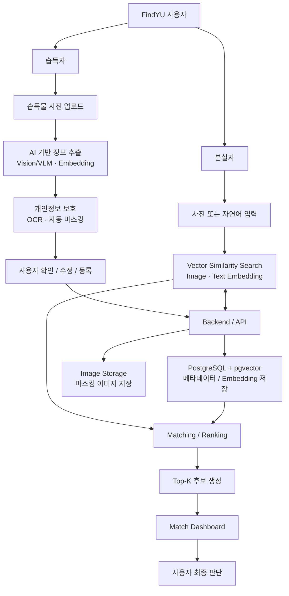

# FindYU

> AI 기반 분실물·습득물 자동 매칭 서비스  
> 2026학년도 2학기 **AI 서비스 프로젝트**

## Overview

**FindYU**는 대학 캠퍼스 환경을 대상으로, 이미지와 자연어 기반 AI 검색 기술을 활용하여 분실물과 습득물을 자동으로 매칭하는 서비스입니다.

기존 분실물 서비스에서는 습득자가 물품 정보를 직접 입력해야 하고, 분실자는 게시글이나 등록 목록을 키워드로 일일이 검색해야 하는 불편함이 있습니다. FindYU는 이를 개선하기 위해 다음과 같은 흐름을 제공합니다.

- 습득자는 **사진 한 장을 업로드**하고 AI가 자동으로 추출한 정보를 확인·수정하여 간편하게 등록
- 분실자는 **사진 또는 자연어 설명**으로 유사한 습득물 검색
- 이미지·텍스트·장소·시간 정보를 종합한 **멀티모달 매칭**
- 하나의 정답을 단정하지 않고 **Top-K 후보**를 제공하여 사용자가 최종 판단
- 업로드 이미지 내 개인정보를 탐지하여 **자동 마스킹**

---

## Key Features

### 1. AI 기반 습득물 간편 등록
습득물 사진에서 Vision / Vision-Language 모델을 활용하여 다음 정보를 자동으로 추출합니다.

- 물품 종류
- 색상
- 브랜드 또는 로고
- 외형적 특징
- 이미지 Embedding

사용자는 AI가 생성한 정보를 확인·수정하고, 습득 장소와 시간 등 최소한의 정보만 입력합니다.

### 2. 개인정보 자동 탐지 및 마스킹
업로드 이미지에 포함될 수 있는 개인정보를 OCR 및 패턴 분석을 통해 탐지합니다.

- 전화번호
- 이메일
- 이름
- 학생증 / 신분증 등

탐지된 개인정보 영역은 자동으로 마스킹하며, 서비스에는 마스킹된 이미지를 저장하는 방향으로 설계합니다.

### 3. 이미지 및 자연어 기반 분실물 검색
분실자는 아래 두 가지 방식으로 검색할 수 있습니다.

- 분실물 사진 업로드
- 자연어 설명 입력  
  예: `어제 오후 공대에서 검은색 갤럭시 버즈를 잃어버렸어요`

자연어 입력에서는 물품 종류, 색상, 특징, 장소, 시간 등의 정보를 추출하여 검색 조건으로 활용합니다.

### 4. Multimodal Similarity Search
검색 시 다음 정보를 종합하여 최종 Matching Score를 계산합니다.

- 이미지 유사도
- 텍스트 의미 유사도
- 위치 적합도
- 시간 적합도

Image-only, Text-only 검색과 비교하여 Multimodal 검색의 성능 향상 여부도 평가합니다.

### 5. Top-K 후보 제공
AI가 하나의 결과를 정답으로 단정하지 않고, 매칭 점수가 높은 습득물을 여러 개 제공합니다.

각 후보에는 다음 정보를 제공합니다.

- 물품 사진
- 종합 매칭 점수
- 습득 장소
- 습득 날짜 및 시간

### 6. Match Dashboard
후보를 선택하면 분실물과 습득물 정보를 비교하여 다음 점수를 시각화합니다.

- 이미지 유사도
- 텍스트 유사도
- 위치 적합도
- 시간 적합도
- 종합 Matching Score

이를 통해 사용자가 AI가 해당 후보를 추천한 이유를 확인할 수 있도록 합니다.

---

## Service Architecture

---

## Core Technologies

### Image Feature Extraction
분실물·습득물 이미지의 시각적 특징을 비교하기 위해 사전 학습된 Vision 모델을 활용합니다.

후보 기술:
- DINOv2
- CLIP
- SigLIP

### Image-Text Multimodal Retrieval
이미지와 자연어를 동일한 의미 공간에서 비교하여 텍스트 입력으로도 유사한 이미지를 검색할 수 있도록 구성합니다.

### Vector Similarity Search
이미지 및 텍스트 Embedding을 벡터 형태로 저장하고, 유사한 벡터를 빠르게 검색합니다.

- PostgreSQL
- pgvector
- Cosine Similarity
- HNSW / IVFFlat

### Vision-Language based Auto Extraction
Vision-capable 모델을 이용해 습득물 사진에서 카테고리, 색상, 브랜드, 외형적 특징 등을 구조화된 형태로 추출합니다.

### OCR-based Privacy Protection
OCR 결과에서 전화번호, 이메일 등 개인정보 패턴을 탐지하고 해당 영역을 자동으로 마스킹합니다.

---

## Planned Tech Stack

### Frontend
- Web-based UI
- 습득물 등록 화면
- 분실물 검색 화면
- Top-K 후보 결과 화면
- Match Dashboard

### Backend
- Python
- FastAPI
- REST API

### Database
- Development: SQLite
- Target: PostgreSQL
- Vector Search: pgvector

### AI / Search
- DINOv2
- CLIP / SigLIP
- Vision-Language Model
- Vector Similarity Search
- Matching / Ranking

### Cloud / Deployment
- Azure
- Azure Blob Storage
- Azure AI Vision OCR
- Azure OpenAI Vision
- Azure Database for PostgreSQL

---

## Current Implementation Status

현재 저장소에는 **백엔드 1차 MVP 구조**가 구현되어 있습니다.

### Implemented
- FastAPI 서버 구성
- Health Check API
- 이미지 업로드 및 로컬 저장
- 습득물/분실물 등록 API
- 등록 데이터 조회 API
- SQLite + SQLAlchemy 기반 데이터 저장
- 이미지 비교 API 구조
- 검색 API 기본 구조
- AI Embedding 연동을 위한 Mock 함수 및 인터페이스

### In Progress / Planned
- 실제 DINOv2 / CLIP / SigLIP Embedding 연동
- 이미지 유사도 기반 실제 검색
- 자연어 기반 검색
- PostgreSQL + pgvector 전환
- OCR 개인정보 탐지 및 마스킹
- Vision-Language 기반 자동 정보 추출
- 위치·시간 기반 Matching Score
- Match Dashboard
- Frontend 구현
- Azure 배포 및 Blob Storage 연동

---

## Performance Goals

| 항목 | 1차 목표 |
|---|---|
| 물품 종류·색상 자동 추출 | 테스트 데이터 기준 80% 이상 일치 |
| 개인정보 탐지 | Recall 90% 이상 우선 목표 |
| 검색 성능 | Top-5 포함률 80% 이상 |
| 검색 성능 | Top-10 포함률 90% 이상 |
| 검색 응답 시간 | 일반 사용자 요청 기준 5초 이내 |
| 멀티모달 검색 | Image-only / Text-only 대비 Top-K 성능 비교 및 개선 |

개인정보 탐지는 Precision, Recall, F1-score를 함께 측정하며, 검색 성능은 Top-1 / Top-5 / Top-10 기준으로 평가합니다.

---

## Data

| 데이터 종류 | 수집 방법 | 활용 목적 |
|---|---|---|
| 물품 이미지 | 팀원 보유 물품 직접 촬영 | 이미지 유사도 검색, Vision 모델 평가 |
| 자연어 설명 | 동일 물품에 대한 다양한 표현 직접 작성 | Text / Multimodal Retrieval 평가 |
| 개인정보 테스트 이미지 | 가상 정보 기반 자체 제작 | OCR 및 개인정보 마스킹 평가 |
| 위치·시간 정보 | 캠퍼스 환경을 가정하여 자체 생성 | Ranking 성능 평가 |

실제 개인정보가 포함된 민감 데이터를 테스트 데이터로 사용하지 않는 것을 원칙으로 합니다.

---

## Team

| 이름 | 역할 | 주요 업무 |
|---|---|---|
| 최인구 | PM / System Integration | 일정 관리, 요구사항 정리, 전체 아키텍처, 기능 통합, 발표 |
| 최준서 | AI / Model | AI 기술 조사, 모델·알고리즘 구현, Embedding, Matching, 성능 평가 |
| 권기백 | Data / Backend | 데이터 수집·전처리, DB 설계, API·서버 구현, AI 연동 |
| 김승보 | Frontend / UI·UX | 사용자 화면 설계, 등록·검색·결과 화면 구현, 사용성 개선 |
| 이수형 | Dashboard / Analysis | 결과 시각화, 통계·지표, Match Dashboard, 테스트 분석 |

---

## Roadmap

### Phase 1 — Research & Planning
`2026.09.23 ~ 2026.09.30`

- 기존 분실물 서비스 사례 조사
- DINOv2 / CLIP / SigLIP / pgvector / Azure Vision OCR 조사
- 서비스 요구사항 정리
- 수행계획서 및 시스템 구조 정리

### Phase 2 — Basic Design
`2026.10.01 ~ 2026.10.19`

- 전체 시스템 아키텍처 설계
- AI 모델 및 검색 방식 선정
- DB 구조 설계
- UI 프로토타입 구현
- Match Dashboard 및 평가 지표 설계
- 초기 AI 검색 결과 확보

### Phase 3 — Midterm Presentation
`2026.10.20`

- 시스템 구조
- 적용 AI 기술
- DB / 데이터 구조
- UI Prototype
- 초기 이미지 / 텍스트 검색 결과
- 핵심 기능 Demo

### Phase 4 — Core Implementation
`2026.10.27 ~ 2026.11.15`

- AI 간편 등록
- 물품 정보 자동 추출
- Backend / API / DB 구축
- 등록·검색·후보 결과 화면 구현
- 개인정보 마스킹
- Match Dashboard 연계
- End-to-End Prototype 구축

### Phase 5 — Testing & Evaluation
`2026.11.16 ~ 2026.11.30`

- 물품 종류·색상 추출 정확도 평가
- 개인정보 탐지 Precision / Recall / F1-score
- Top-1 / Top-5 / Top-10 검색 성능
- Image-only / Text-only / Multimodal 비교
- 검색 응답시간 측정

### Phase 6 — Final Integration
`2026.12.01 ~ 2026.12.08`

- 모델 및 Ranking 개선
- UI / UX 보완
- Dashboard 개선
- 서비스 안정화
- 최종 시연 및 발표

### Phase 7 — Analysis
`2026.12.09 ~ 2026.12.18`

- 최종 성능 분석
- 오류 사례 분석
- 한계점 및 개선 방안
- 실사용 및 기관 적용 가능성 검토

---

## Project Goal

FindYU는 영남대학교 캠퍼스를 1차 적용 대상으로 설계합니다.

가능한 경우 교내 분실물 관리 관련 부서와 협의하여 실제 관리 방식과 요구사항을 조사하고, 비식별화된 범위에서 서비스의 적용 가능성을 검증하는 것을 목표로 합니다.

향후에는 대학 캠퍼스를 넘어 다음과 같은 환경으로 확장할 수 있는 구조를 지향합니다.

- 도서관
- 기숙사
- 대중교통
- 공공시설
- 기타 분실물이 빈번한 환경

---

## References

1. 경찰청, **경찰민원24**  
   https://minwon24.police.go.kr/main.do

2. Lost & Found App, **Lost & Found App – Simply Foundtastic**  
   https://www.lostfoundapp.com/

3. M. Oquab et al., **DINOv2: Learning Robust Visual Features without Supervision**, 2023  
   https://github.com/facebookresearch/dinov2

4. OpenAI, **CLIP: Connecting Text and Images**, 2021  
   https://openai.com/index/clip/

5. X. Zhai et al., **Sigmoid Loss for Language Image Pre-Training**, 2023  
   https://arxiv.org/abs/2303.15343

6. pgvector, **Open-source Vector Similarity Search for PostgreSQL**  
   https://github.com/pgvector/pgvector

7. Microsoft, **Vision-enabled chat models in Azure OpenAI / Microsoft Foundry**  
   https://learn.microsoft.com/en-us/azure/foundry/openai/how-to/gpt-with-vision

8. Microsoft, **Azure AI Vision OCR / Read API**  
   https://learn.microsoft.com/en-us/azure/ai-services/computer-vision/how-to/call-read-api

---

## License

This project is being developed as part of the **2026-2 AI Service Project** course.
